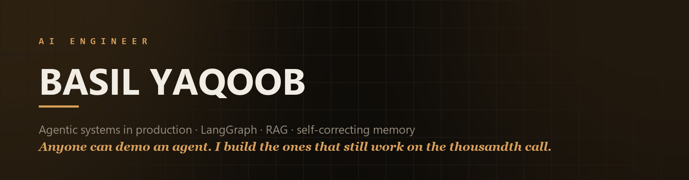
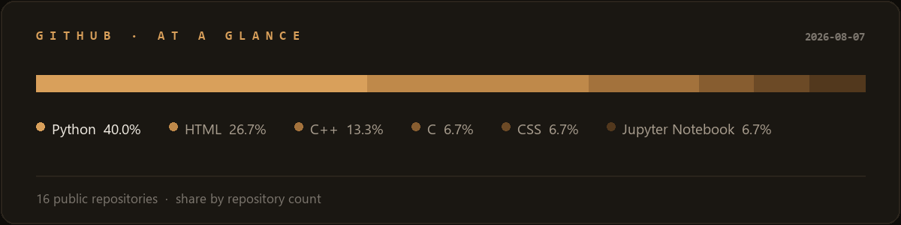

<p align="center">
  <a href="https://basil-yaqoob.vercel.app"></a>
  <a href="https://linkedin.com/in/basil-yaqoob"></a>
  <a href="mailto:basilyaqoob18@gmail.com"></a>
  
</p>

---

## Currently

**AI Engineer at [SiRiiL](https://beta.siriil.com)**, building LangGraph agents that automate the
accounting close — reconciling banks, generating IFRS-style financial statements, and writing the
commentary that explains them.

- 🏭 **20 months of agentic AI in production** — not demos, real client ledgers
- 🚀 **Three systems shipped** — a financial-close platform, a local-first desktop assistant, an autonomous voice agent
- 🔬 **Research-grade ML** — 86.3% accuracy on multimodal activity recognition, validated leave-one-subject-out
- 🎓 **BS Computer Science**, FAST-NUCES Karachi — AI & Machine Learning
- 💬 Ask me about multi-agent orchestration, RAG over messy enterprise data, or why your agent breaks at scale

---

## The shape of everything I ship

```
                 ┌──────────┐
   input ──────► │  ROUTER  │  intent → path
                 └────┬─────┘
                      ▼
                 ┌──────────┐
                 │  TOOLS   │  schema-validated · approval-gated
                 └────┬─────┘
                      ▼
                 ┌──────────┐
                 │ RETRIEVE │  knowledge graph + vector memory  ◄──┐
                 └────┬─────┘                                      │
                      ▼                                            │
                 ┌──────────┐                                      │
                 │ RESPOND  │  grounded, cited, structured         │ learns
                 └────┬─────┘                                      │
                      ▼                                            │
                 ┌──────────┐                                      │
                 │  UPDATE  │  extract facts → memory ─────────────┘
                 └──────────┘
```

Agents get a **contract, not a prompt**. Side effects are **approval-gated**. Corrections become
**validated rules**, not noise. Models are routed by **cost, not habit**.

---

## Featured work

| Project | What it does | |
|---|---|---|
| **SiRiiL** | Agentic financial-close platform. Self-improving bank reconciliation over pgvector, an 11-level statement pipeline, 25+ ratios and AI commentary. | [Live](https://beta.siriil.com) |
| **Ollie** | Local-first desktop AI assistant. Temporal knowledge graph + vector memory, 65 tools with 26 approval-gated, ships as one installer. | [Live](https://siriil.com/ollie) |
| **E-commerce Agentic Insights** | Multi-store analytics with LLM-driven KPI reporting and a RAG assistant for plain-English querying. | [Repo](https://github.com/Basil-Yaqoob/Data-Visualization-for-Ecommerce-Store) |
| **ActionFusion** | Data-, feature- and decision-level fusion across skeleton, inertial, depth and RGB. Fusing decisions beat fusing features by 35 points. | [Repo](https://github.com/Basil-Yaqoob/ActionFusion-A-Multimodal-Approach-for-Human-Activity-Recognition) |
| **WriteID** | Identifies *who* wrote a page, not what it says. Siamese network over ResNet50 embeddings on IAM. | [Repo](https://github.com/Basil-Yaqoob/WriteID-Writer-Handwriting-Identification---Using-RESNET50) |
| **StudyNotes AI** | CrewAI agents turning YouTube lectures into structured study notes. | [Repo](https://github.com/Basil-Yaqoob/StudyNotes_AI) |

<p align="right"><a href="https://basil-yaqoob.vercel.app">→ full portfolio with case studies</a></p>

---

## Stack

**Agents & LLM**


**ML & Deep Learning**


**Backend & Data**


**Interfaces & Delivery**


---

## GitHub



<sub>Rendered from the GitHub API by [`scripts/generate_stats.py`](./scripts/generate_stats.py) and
refreshed weekly by a [scheduled Action](./.github/workflows/refresh-stats.yml) — self-hosted, so it
can't break when a third-party badge service goes down.</sub>

---

<p align="center">
  <strong>Open to AI engineering roles — remote or relocation.</strong><br>
  <sub>If you're putting agents in front of real users and real data, that's the problem I want.</sub>
</p>

<p align="center">
  <a href="https://basil-yaqoob.vercel.app">basil-yaqoob.vercel.app</a> ·
  <a href="mailto:basilyaqoob18@gmail.com">basilyaqoob18@gmail.com</a>
</p>
